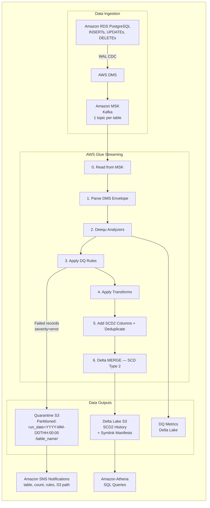

# Streaming ETL Framework with Data Quality

Config-driven CDC streaming ETL on AWS. Define tables, DQ rules, transforms, and Deequ checks in a single `tables.yaml` — the framework handles validation, compilation, deployment, and data generation.

**Amazon RDS PostgreSQL → AWS DMS (CDC) → Amazon MSK (Kafka) → AWS Glue Streaming → Delta Lake (Amazon S3)**

## Architecture

Each deployment creates a fully isolated AWS stack. The same framework code powers any use case — only the YAML config changes.



**How it works:**
- Write a `tables.yaml` — define your tables, schemas, DQ rules, transforms, and Deequ checks
- Run `deploy.sh` — validates config, compiles DMS mappings + RDS DDL + CloudFormation params, deploys a complete isolated stack
- Data flows automatically: Amazon RDS → AWS DMS (CDC) → Amazon MSK (Kafka) → AWS Glue 7-step pipeline → Delta Lake
- Failed DQ records are quarantined to Amazon S3 (partitioned by hour + table), with Amazon SNS email alerts
- Query results in Amazon Athena. Each stack is fully independent — deploy multiple use cases side by side.

## Features

| Feature | Description |
|---------|-------------|
| **Config-driven pipeline** | One YAML defines tables, schemas, DQ rules, transforms, and Deequ checks |
| **Config validation** | `config_validator.py` validates your YAML before deployment |
| **Config compilation** | `config_compiler.py` generates DMS mappings, RDS DDL, and CFn parameters |
| **DQ rules** | `range`, `allowed_values`, `regex`, `not_null`, `unique`, `length` (extensible via `register()`) |
| **Transforms** | `trim`, `lower`, `upper`, `round`, `mask_pii`, `cast`, `default_value`, `rename` (extensible via `register()`) |
| **Deequ integration** | Completeness, uniqueness, compliance, and size metrics |
| **SCD Type 2** | History tracking with `_effective_from`, `_effective_to`, `_is_current` |
| **Quarantine** | Failed DQ records isolated with failure reason |
| **Isolated stacks** | Each deployment is a fully independent CloudFormation stack |
| **Example use cases** | `vehicle-telemetry` (5 tables) and `healthcare-iot` (2 tables, PII masking) |

## Security

- No hardcoded credentials — passwords provided at deploy time via CLI, environment variables, or interactive prompt
- All secrets stored in AWS Secrets Manager, encrypted with a customer-managed AWS KMS key (rotation enabled)
- Amazon MSK SASL/SCRAM-SHA-512 authentication with TLS enforcement
- IAM database authentication enabled on Amazon RDS
- Per-Lambda IAM roles with least-privilege policies
- All Amazon S3 buckets: SSE-KMS encryption, versioning, access logging, TLS-only bucket policies, Block Public Access
- Amazon SNS topic encrypted with AWS KMS
- VPC isolation with private subnets, security group references (no broad CIDRs), and VPC Flow Logs
- Lambda concurrency limits on all functions
- Amazon MSK broker logging to Amazon CloudWatch

See [SECURITY.md](SECURITY.md) for the full security design, accepted debt, and production hardening recommendations.

## Prerequisites

- AWS account with permissions for AWS CloudFormation, Amazon RDS, AWS DMS, Amazon MSK, AWS Glue, Amazon S3, AWS IAM, AWS Lambda, AWS Secrets Manager, Amazon Athena, AWS KMS, Amazon SNS
- EC2 instance running Amazon Linux 2023 (or any Linux with git)

## Getting Started

### 1. Install git

```bash
sudo dnf install -y git && git --version
```

### 2. Clone the repo

```bash
git clone https://github.com/<your-org>/<your-repo>.git && cd <your-repo> && chmod +x scripts/*.sh
```

### 3. Run EC2 setup (installs Python 3.10, other dependencies). Takes ~3 mins

```bash
./scripts/setup-ec2.sh
```

### 4. Configure AWS credentials

Option 1 — IAM Instance Profile (recommended): attach an IAM role with the required permissions to your EC2 instance.

Option 2 — AWS CLI:

```bash
aws configure
# Enter: Access Key ID, Secret Access Key, Region, Output format (json)
```

Verify:

```bash
aws sts get-caller-identity
```

### 5. Deploy

#### Set your variables:

```bash
STACK="my-etl-stack"
REGION="us-east-1"
USE_CASE="vehicle-telemetry"   # Options: vehicle-telemetry | healthcare-iot
SNS_EMAILS=""                  # Optional: comma-separated emails for DQ failure alerts
```

#### Deploy the stack (~35-40 mins, Amazon MSK is the bottleneck):

Passwords can be provided three ways (choose one):

**Option A — Interactive prompt (recommended, most secure):**
```bash
./scripts/deploy.sh --stack-name $STACK --use-case $USE_CASE --region $REGION
# You will be prompted to enter RDS and MSK passwords securely (input hidden)
```

**Option B — CLI flags:**
```bash
./scripts/deploy.sh --stack-name $STACK --use-case $USE_CASE --region $REGION \
  --rds-password "YourRdsPass123" --msk-password "YourMskPass123"
```

**Option C — Environment variables:**
```bash
export RDS_PASSWORD="YourRdsPass123"
export MSK_PASSWORD="YourMskPass123"
./scripts/deploy.sh --stack-name $STACK --use-case $USE_CASE --region $REGION
```

> Passwords must be 8-41 characters. On stack updates, previously set passwords are reused automatically if not provided again.

#### Run post-deploy setup:

Creates RDS tables, Kafka topics, starts AWS DMS + AWS Glue, creates Amazon Athena tables, seeds test data, and subscribes SNS emails.

```bash
./scripts/post-deploy.sh --stack-name $STACK --use-case $USE_CASE --region $REGION --emails "$SNS_EMAILS"
```

#### Generate more test data:

```bash
./scripts/post-deploy.sh --stack-name $STACK --use-case $USE_CASE --region $REGION \
  --skip-tables --skip-topics --skip-dms --skip-glue
```

Or invoke the data generator Lambda directly:

```bash
aws lambda invoke --function-name ${STACK}-data-generator \
  --payload '{"action": "burst", "records": 200}' /tmp/out.json --region $REGION
cat /tmp/out.json
```

#### Teardown when done:

```bash
./scripts/teardown.sh --stack-name $STACK --region $REGION --force
```

## Project Structure

```
├── cloudformation/
│   └── streaming-etl.yaml              # Parameterized CloudFormation template
├── examples/
│   ├── vehicle-telemetry/
│   │   ├── config/tables.yaml          # 5 tables: vehicles, drivers, telemetry, deliveries, alerts
│   │   └── scripts/
│   │       ├── data_generator.py       # Lambda: seed/generate/burst with DQ violations, SCD2
│   │       └── analytics_queries.sql
│   └── healthcare-iot/
│       ├── config/tables.yaml          # 2 tables: patients, vitals (PII masking, clinical ranges)
│       └── scripts/
│           ├── data_generator.py       # Lambda: seed/generate/burst with PII, clinical DQ
│           └── analytics_queries.sql
├── scripts/
│   ├── deploy.sh                       # Validate, compile, deploy stack, upload assets
│   ├── post-deploy.sh                  # Create tables/topics, start DMS/Glue, seed data
│   ├── teardown.sh                     # Full resource cleanup
│   └── setup-ec2.sh                    # One-command EC2 setup (Python 3.10, AWS CLI, PyYAML)
├── src/
│   ├── glue_streaming_job.py           # Main Glue streaming job (domain-agnostic)
│   ├── deequ_analyzer.py               # Deequ DQ metrics analyzer
│   ├── config_validator.py             # Config validation
│   ├── config_compiler.py              # Compiles config → DMS mappings, DDL, CFn params
│   └── libs/                           # Pre-downloaded wheels and JARs
├── .threatmodel/
│   └── STRIDE.md                       # STRIDE threat model
├── LICENSE                             # MIT-0 License
├── SECURITY.md                         # Security design, accepted debt, hardening guide
└── README.md
```

## Configuration

Each use case is defined by a single `tables.yaml`. Here's a condensed example:

```yaml
settings:
  checkpoint_location: "s3://${STACK_NAME}-assets-${AWS_ACCOUNT_ID}/checkpoints/"
  quarantine_path: "s3://${STACK_NAME}-quarantine-${AWS_ACCOUNT_ID}/"
  delta_bucket: "${STACK_NAME}-delta-${AWS_ACCOUNT_ID}"
  trigger_interval: "15 seconds"

kafka:
  bootstrap_servers: "PLACEHOLDER_BOOTSTRAP_SERVERS"
  security_protocol: "SASL_SSL"
  sasl_mechanism: "SCRAM-SHA-512"
  sasl_username: "kafkaadmin"

source_database:
  engine: "postgres"
  schema_name: "public"

tables:
  - name: vehicle_telemetry
    topic: cdc-vehicle_telemetry
    delta_path: "s3://${STACK_NAME}-delta-${AWS_ACCOUNT_ID}/vehicle_telemetry/"
    primary_key: id
    schema:
      - {name: id, type: integer, nullable: false}
      - {name: vehicle_id, type: integer, nullable: true}
      - {name: speed_kmh, type: double, nullable: true}
      - {name: latitude, type: double, nullable: true}

    dq_rules:
      - {id: tel_001, type: range, column: latitude, params: {min: -90, max: 90}, severity: error}
      - {id: tel_002, type: not_null, column: vehicle_id, params: {}, severity: error}

    transforms:
      - {id: tel_tx_001, type: round, column: latitude, params: {decimals: 5}, order: 1}

    deequ_checks:
      - {metric: completeness, column: vehicle_id, threshold: 0.95, severity: warning}
      - {metric: uniqueness, column: id, threshold: 1.0, severity: error}
```

## DQ Rules Reference

| Rule | Parameters | Description |
|------|------------|-------------|
| `range` | `min`, `max` | Value must be within numeric range |
| `allowed_values` | `values` (list) | Value must be in the allowed set |
| `regex` | `pattern` | Value must match the regex pattern |
| `not_null` | — | Value must not be null |
| `unique` | — | Value must be unique within the batch |
| `length` | `min`, `max` | String length must be within range |

Custom rules can be added via `register()` in the DQ engine.

## Transform Rules Reference

| Transform | Parameters | Description |
|-----------|------------|-------------|
| `trim` | — | Strip leading/trailing whitespace |
| `lower` | — | Convert to lowercase |
| `upper` | — | Convert to uppercase |
| `round` | `decimals` | Round numeric value |
| `mask_pii` | `visible_chars` | Mask all but last N characters |
| `cast` | `to_type` | Cast column to a different type |
| `default_value` | `value` | Fill nulls with a default value |
| `rename` | `new_name` | Rename the column |

Custom transforms can be added via `register()` in the transform engine.

## Creating a New Use Case

1. Create `examples/<your-use-case>/config/tables.yaml` with your table definitions, DQ rules, transforms, and Deequ checks.
2. Optionally create `examples/<your-use-case>/scripts/data_generator.py` for test data generation.
3. Deploy:
   ```bash
   ./scripts/deploy.sh --stack-name <name> --use-case <your-use-case> --region <region>
   ./scripts/post-deploy.sh --stack-name <name> --use-case <your-use-case> --region <region>
   ```

## Service Versions

| Service | Version |
|---------|---------|
| Amazon RDS PostgreSQL | 16.11 |
| Amazon MSK (Kafka) | 3.5.1 |
| AWS DMS | 3.5.4 |
| AWS Glue | 4.0 (Spark 3.3, Python 3.10) |
| Deequ | 2.0.4-spark-3.3 |
| PyDeequ | 1.2.0 |
| Delta Lake | 2.4.0 |

## Cost Estimate

| Resource | Estimated Cost | Notes |
|----------|---------------|-------|
| Amazon MSK (2 brokers) | ~$200/month | kafka.t3.small |
| Amazon RDS PostgreSQL | ~$15/month | db.t3.micro, Multi-AZ enabled |
| AWS Glue Streaming | ~$50/month | 2 DPUs @ $0.44/DPU-hour (when running) |
| AWS DMS Replication | ~$30/month | dms.t3.small |
| Amazon S3 Storage | ~$5/month | Varies with data volume |
| NAT Gateway | ~$35/month | $0.045/hour + data transfer |

Stop the AWS Glue job when not testing. Use `./scripts/teardown.sh` when done.

## Troubleshooting

| Issue | Solution |
|-------|----------|
| Unable to locate credentials | Configure AWS CLI or attach IAM role to EC2 |
| AWS DMS task fails | Check security groups, verify Amazon RDS credentials in AWS Secrets Manager |
| No data in Kafka | Ensure AWS DMS task is running, check table mappings |
| AWS Glue job fails | Check Amazon CloudWatch logs, verify Amazon MSK bootstrap servers |
| Empty Delta tables | Verify Kafka topics have data, check checkpoints |
| KMS AccessDeniedException | Ensure Lambda IAM roles have `kms:Decrypt` on the KMS key |

## License

This library is licensed under the MIT-0 License. See the [LICENSE](LICENSE) file.
